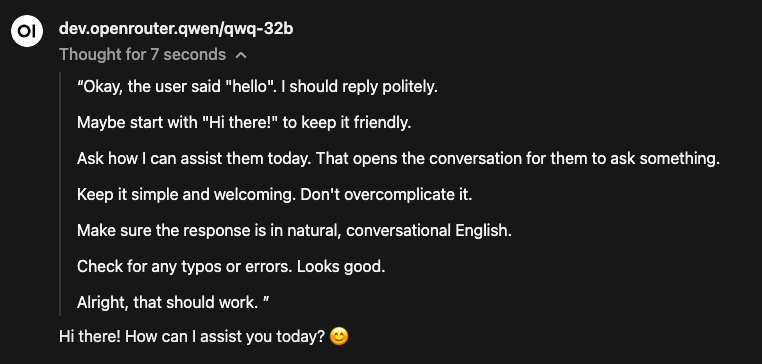

# Open WebUI Reasoning Content Formatter

This function brings back the reasoning content for reasoning models. It converts the configurable reasoning content field from the response and wrap it with <thinking> tags.

## Setup

1. Import the function.
2. Enable the function.
3. Configure valve:
    - **content_tag**: The content tag of the API response. Defaults to 'content'."
    - **reasoning_tag**: The reasoning tag of the api response. Defaults to 'reasoning', some provider uses 'reasoning_content'.
4. Enable the function for your desired model.
    - Navigate to "Models" in Admin tab.
    - Select the model you want to enable this function.
    - Under "filters", check the Reasoning Content Formatter function.
5. Alternatively, create a model under "workspace"
    - Navigate to "workspace".
    - Click the "+" button.
    - Enter model name, model id, and select desired a base model.
    - Under "filters", check the Reasoning Content Formatter function.

## Screenshot 

> Tested on Openrouter's QwQ-32B
